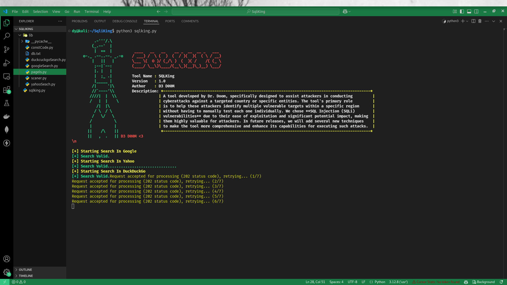

# SQL KING

[](https://github.com/yourusername/SQLKing/stargazers) [](https://gitter.im/yourusername/SQLKing)

SQLKing is a powerful tool developed by Dr. Doom, designed to assist attackers in identifying SQL Injection (SQLi) vulnerabilities in websites. It automates the process of finding vulnerable targets within specific regions, minimizing manual testing. SQLKing will evolve with future updates adding new techniques to enhance its capabilities.



---

## Buy me a coffee

If you use this tool, find it helpful, or just want to support its development, consider buying me a coffee! Your support will help me dedicate more time to open-source projects like SQLKing :)

<a href="https://www.buymeacoffee.com/drdoom" target="_blank">
  
</a>


## How To Use

```bash

# Clone this repository
$ git clone https://github.com/Saad-Ayady/SqlKing.git

# Go into the repository
$ cd SqlKing

# Chang Chmod
$ chmod +x sqlking.py

# Run the tool
$ python3 sqlking.py 'inurl:".php?id=" site:".dz"' 200

```

> **Note**

> If you're windows user just baypass chmod part :)

## License

MIT

---

> Twitter [@SaadAyady](https://x.com/SaadAyady)

> Facebook [DrDoom](https://web.facebook.com/profile.php?id=100093350419814)
>
